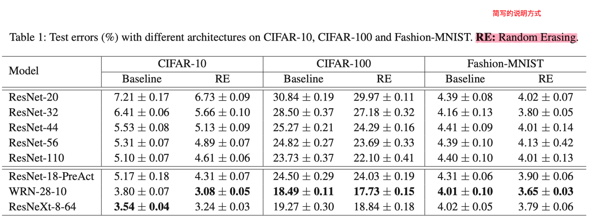

# Experiments

## 1.章节结构（Structure）

AI方向论文的章节结构：

```
4 Experiments
4.1. Experimental Settings/Setup（实验环境）
	4.1.1. Datasets/Dataset and Model
	4.1.2. Evaluation Metrics/Metrics
	※4.1.3. Methods for Comparison（介绍对比的方法）
	4.1.3. Implementation（实验环境的一些设计，实验细节）
※4.2. Comparison with Baseline Methods（和Baseline的对比，验证优越性）
4.3. Ablation Study/Studies（消融实验）
※4.4. Cross Datasets Generalization（跨数据集泛化性的评估）
```


## 2.数据集（Datasets）

**常用词：** Datasets、Dataset and Model


## 3.模型（Model）

**介绍：** 非必须模块，主要作为载体出现，一般来说：

- 如果提出一种新的模型结构，则不需要此模块；
- 如果提出了一种插件式的工具/模块，则可能需要介绍此部分内容。例如：提出数据增强方法，那需要介绍使用的什么模型+数据增强方法来验证的可行性。又例如：提出了一种攻击方法，要需要介绍在针对哪些模型做的攻击。

**常用词：** Dataset and Model（一般与数据集一起出现）


## 4.Evaluation Metrics（评价指标）

**简介：** 必须模块。

**常用词：** Evaluation Metrics、Metrics

**常见结构：**

- **开门见山型：** 介绍评价指标/介绍评价指标+评估内容
  - We adopt six classical metrics, including xx1, xx2, xx3, xx4, xx5 and xx6 for our evaluations. 
  - We utilize the COCO-style mean Average Precision (mAP) as the evaluation metrics.
  - We utilize the COCO-style mean Average Precision (mAP) as the evaluation metrics to assess the performance of our proposed method on different pedestrian detectors. 
- **创新型：** 要介绍相关工作评价指标的不适用，然后提出自己的评价指标
  - In classification-based tasks, the performance of backdoor attacks is usually measured by Benign Accuracy (BA) and Attack Success Rate (ASR), which are calculated based on the classification accuracy. However, such metrics may be not suitable to evaluate the backdoor attack performance in the xxx task, where the model output for one image is a set of continuous points.（介绍相关工作的评价指标 + However转折 + 介绍不适用的原因）


## 5.实验图表（Table and Figure）

**Q1：** 图表中的“简写”应该怎么说明？

**A1：** 参考AAAI'20《Random Erasing Data Augmentation》




