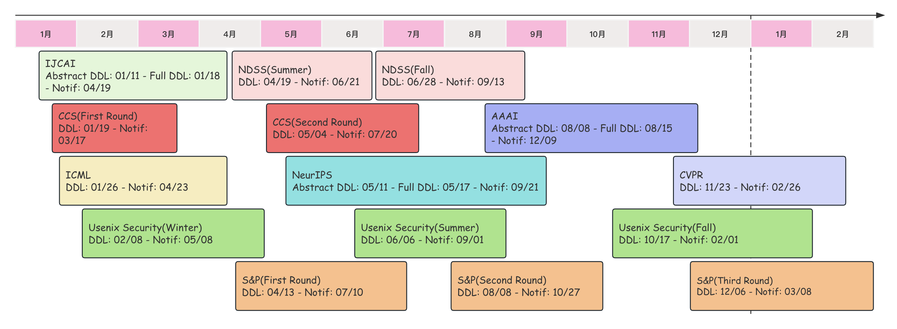

# 会议投稿时间线

**参考资料：**

- **实验室网站记录的CallForPapers：** [https://docs.qq.com/sheet/DT3NnaE5vUnZ5Rkx6](https://docs.qq.com/sheet/DT3NnaE5vUnZ5Rkx6)
- **CCF DDL：** [https://ccfddl.top/](https://ccfddl.top/)
- **Call4Papers：** [http://123.57.137.208/C4PREST/ccf/ccf-3.jsp](http://123.57.137.208/C4PREST/ccf/ccf-3.jsp)
- **IEEE CFP：** [https://www.computer.org/publications/author-resources/calls-for-papers](https://www.computer.org/publications/author-resources/calls-for-papers)

**CCF-A会议：**

| 会议名称                        |    领域分类    | 会议级别 |       截稿日期        |
| :------------------------------ | :------------: | :------: | :-------------------: |
| IJCAI-2024【*寒假前】           |    人工智能    |  CCF-A   | <del>2024.01.18</del> |
| CCS-2024（第1/2轮）             | 网络与信息安全 |  CCF-A   | <del>2024.01.28</del> |
| ICML-2024                       |    人工智能    |  CCF-A   |      2024.02.02       |
| ACM MM-2024                     |  计算机图形学  |  CCF-A   |      2024.04.13       |
| NDSS-2025（第1/2轮）            | 网络与信息安全 |  CCF-A   |      2024.04.17       |
| CCS-2024（第2/2轮）             | 网络与信息安全 |  CCF-A   |      2024.04.29       |
| NeurIPS-2024                    |    人工智能    |  CCF-A   |      2024.05.22       |
| S&P-2025（第1/2轮）             | 网络与信息安全 |  CCF-A   |      2024.06.06       |
| NDSS-2025（第2/2轮）            | 网络与信息安全 |  CCF-A   |      2024.07.10       |
| AAAI-2024【*暑假】              |    人工智能    |  CCF-A   |      2023.08.16       |
| Usenix Security-2024（第1/2轮） | 网络与信息安全 |  CCF-A   |      2024.09.04       |
| CVPR-2024                       |    人工智能    |  CCF-A   |      2023.11.11       |
| S&P-2025（第1/2轮）             | 网络与信息安全 |  CCF-A   |      2024.11.14       |
| Usenix Security-2025（第2/2轮） | 网络与信息安全 |  CCF-A   |      2025.01.22       |

**CCF-B/CCF-C会议：**

| 会议名称                                                     |    领域分类    |   会议级别    |  截稿日期   |
| :----------------------------------------------------------- | :------------: | :-----------: | :---------: |
| ESORICS-2024（第1/2轮）                                      | 网络与信息安全 | CCF-B/网安top | >2024.01.08 |
| [IJCNN-2024](https://2024.ieeewcci.org/)                     |    人工智能    |     CCF-C     | 2024.01.15  |
| [KSEM-2024](https://ai-edge.net/)                            |    人工智能    |     CCF-C     | 2024.01.15  |
| ECCV                                                         |    人工智能    |     CCF-B     | 2024.03.07  |
| ESORICS-2024（第2/2轮）                                      | 网络与信息安全 | CCF-B/网安top | 2024.04.19  |
| SRDS-2023                                                    | 网络与信息安全 | CCF-B/网安top | 2023.04.23  |
| ACSAC-2023                                                   | 网络与信息安全 | CCF-B/网安top | 2023.05.27  |
| [ACM SIGSPATIAL-2023](http://sigspatial2023.sigspatial.org/) | 交叉/综合/新兴 |     CCF-C     | 2023.06.09  |
| [ICONIP-2023](http://iconip2023.org/)                        |    人工智能    |     CCF-C     | 2023.06.10  |
| [PRCV-2023](https://prcv2023.xmu.edu.cn/lwtg.htm)            |    人工智能    |     CCF-C     | 2023.06.20  |
| <b style="color:red">AsiaCCS-2024</b>                        | 网络与信息安全 | CCF-C/网安top | 2023.08.22  |
| DSN-2024                                                     | 网络与信息安全 | CCF-B/网安top | 2023.12.07  |
| AsiaCCS-2024（第2/2轮）                                      | 网络与信息安全 | CCF-C/网安top | 2023.12.08  |
| SOUPS                                                        | 网络与信息安全 | CCF-C/网安top |             |
| WiSec                                                        | 网络与信息安全 | CCF-C/网安top |             |
| CSF                                                          |       —        |    网安top    |             |
| RAID                                                         |       —        |    网安top    |             |
| ICASSP                                                       |                |     CCF-B     |             |

