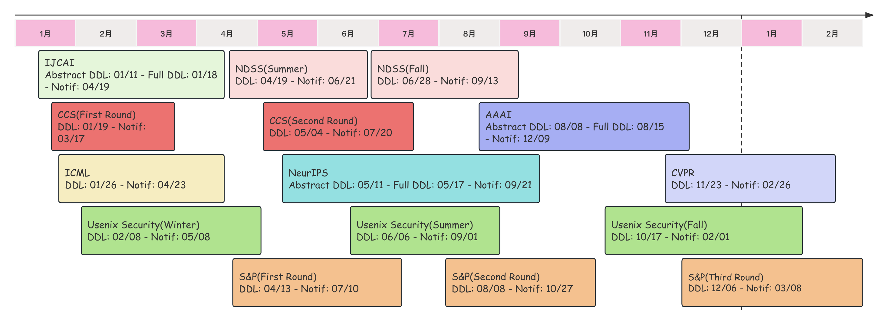

# 会议投稿时间线

### 2024 CCF-DDL

| 会议名称                                                     |    领域分类    | 会议级别 | 截稿日期                                                     |
| :----------------------------------------------------------- | :------------: | :------: | ------------------------------------------------------------ |
| [IJCAI-2024](https://ijcai24.org/)                           |    人工智能    |  CCF-A   | 2024.01.18                                                   |
| [ICML-2024](https://icml.cc/Conferences/2024)                |    人工智能    |  CCF-A   | 2024.02.02                                                   |
| [Usenix Security-2024](https://www.usenix.org/conference/usenixsecurity24) | 网络与信息安全 |  CCF-A   | <del>2023.06.07（2024-1/3</del>） <del>2023.10.18（2024-2/3）</del> 2024.02.09（2024-3/3） |
| [ECCV](https://eccv2024.ecva.net/)                           |    人工智能    |  CCF-B   | 2024.03.07                                                   |
| [ACM MM-2024](https://2024.acmmm.org/)                       |  计算机图形学  |  CCF-A   | 2024.04.13                                                   |

### 2023 CCF-DDL

| 会议名称     |    领域分类    | 会议级别 | 截稿日期                                                     |
| :----------- | :------------: | :------: | ------------------------------------------------------------ |
| CCS-2023     | 网络与信息安全 |  CCF-A   | 2023.01.20（2023-1/2） 2023.05.05（2023-2/2）           |
| FSE-2023     |    软件工程    |  CCF-A   | 2023.03.01（2023-2/4） 2023.06.01（2023-3/4） 2023.09.01（2023-4/4） 2023.11.23（2024-1/4） |
| ICCV-2023    |    人工智能    |  CCF-A   | 2023.03.08                                                   |
| S&P-2024     | 网络与信息安全 |  CCF-A   | 2023.04.14（2024-1/3） 2023.08.04（2024-2/3） 2023.08.04（2024-2/3） |
| NDSS-2024    | 网络与信息安全 |  CCF-A   | 2023.04.20（2024-1/2） 2023.06.29（2024-2/2）            |
| SRDS-2023    | 网络与信息安全 |  CCF-B   | 2023.04.23                                                   |
| ASE-2023     |    软件工程    |  CCF-A   | 2023.05.06                                                   |
| NeurIPS-2023 |    人工智能    |  CCF-A   | 2023.05.18                                                   |
| ACSAC-2023   | 网络与信息安全 |  CCF-B   | 2023.05.27                                                   |
| ICSE-2023    |    软件工程    |  CCF-A   | 2023.08.02                                                   |
| AAAI-2024    |    人工智能    |  CCF-A   | 2023.08.16                                                   |
| AsiaCCS-2024 | 网络与信息安全 |  CCF-C   | 2023.08.22（2024-1/2） 2023.12.08（2024-2/2）           |
| WWW-2024     | 交叉/综合/新兴 |  CCF-A   | 2023.10.13                                                   |
| CVPR-2024    |    人工智能    |  CCF-A   | 2023.11.11                                                   |
| ISSTA-2024   |    软件工程    |  CCF-A   | 2023.12.26                                                   |

