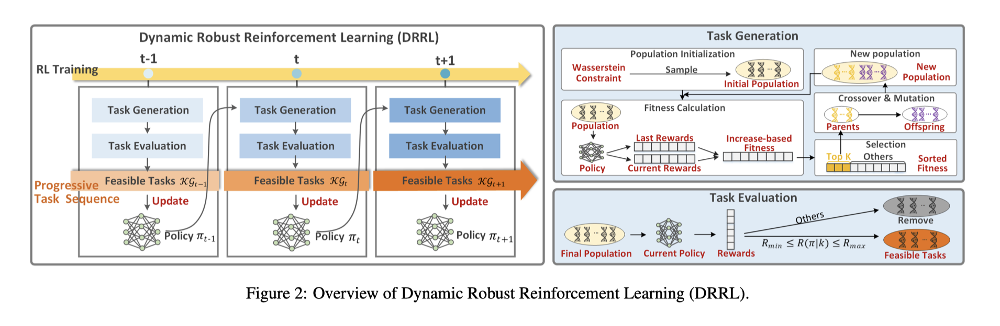
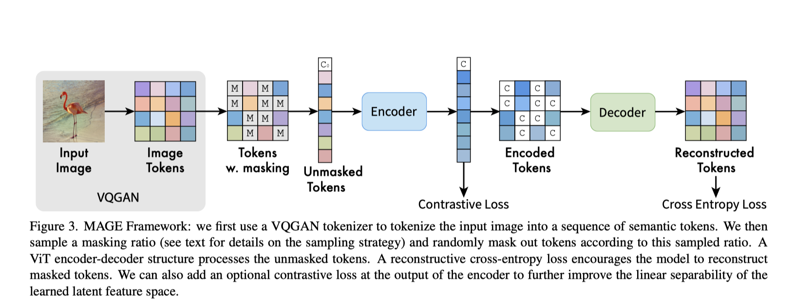
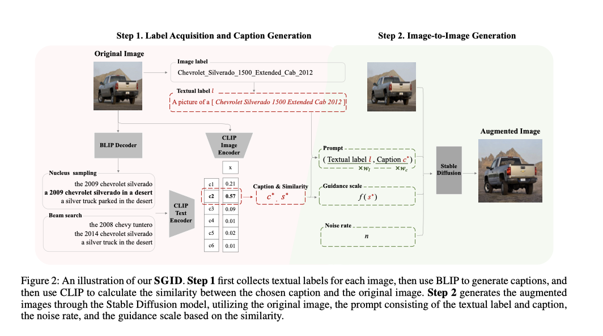
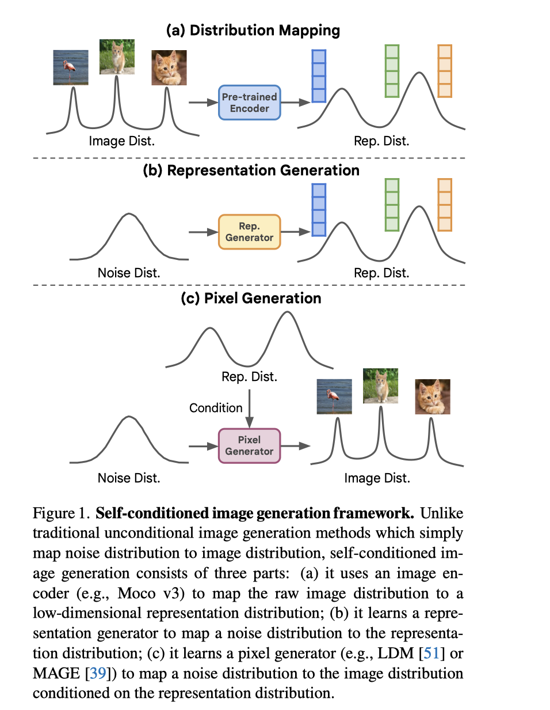

# 框架图

- **Robust Reinforcement Learning via Progressive Task Sequence.** *IJCAI, 2023.*

  

- **MAGE: MAsked Generative Encoder to Unify Representation Learning and Image Synthesis.** *CVPR, 2023.*

  

- **Semantic-Guided Generative Image Augmentation Method with Diffusion Models for Image Classification.** *arxiv, 2023.*

  

- **Self-conditioned Image Generation via Generating Representations.** *arXiv, 2023.*

  
